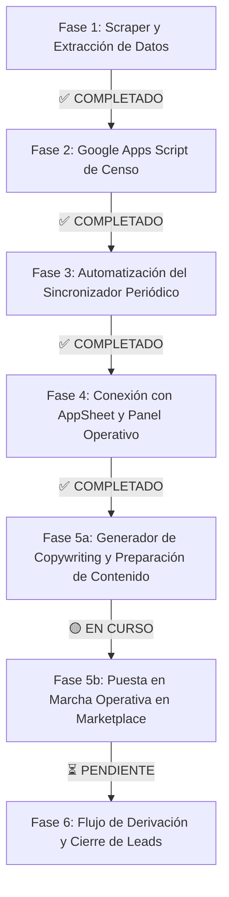

# 🚀 Plan Integral y Pasos Concretos: Autocity → Leads → Facebook Marketplace

Documento maestro con la arquitectura, separación de datos y las fases de ejecución hasta la finalización del proyecto.

**v2.1** — Actualizado: Fases 1, 2, 3, 4 y 5a COMPLETADAS. Fase 5b (Puesta en marcha operativa y comercial) en curso.

---

## 🎯 Objetivo Global del Proyecto

Construir un flujo semi-automatizado que:
1. Extraiga y mantenga actualizado el inventario de **usados** de Autocity Argentina.
2. Centralice los datos en **Google Sheets** (base operativa) conectada a **AppSheet** (panel de gestión).
3. Gestione un cupo activo y rotativo de **50 vehículos en Facebook Marketplace**.
4. Genere anuncios comerciales y facilite la publicación/despublicación semi-automática.
5. Derive las consultas de compradores (leads) a los vendedores de Autocity para monetizar como dateros.

---

## 🗂️ Modelo de Datos: Separación Estricta de Campos

Para garantizar que las sincronizaciones automáticas nunca pisen la gestión humana, la base de datos se divide en **3 capas funcionales**:

```
┌───────────────────────────┐      ┌───────────────────────────┐      ┌───────────────────────────┐
│   1. DATOS DE AUTOCITY    │      │   2. GESTIÓN INTERNA      │      │    3. DATOS MARKETPLACE   │
│   (Actualizados por Scraper)│      │   (Operación y Ventas)    │      │  (Generados para Publicar) │
└───────────────────────────┘      └───────────────────────────┘      └───────────────────────────┘
```

### 1. Datos provenientes de Autocity (Solo lectura / Scraper)
* **`id_autocity`**: ID numérico único (ej: `93401`).
* **`marca`**: Nombre oficial de la marca (ej: `Renault`).
* **`modelo`**: Nombre oficial del modelo (ej: `Duster`).
* **`version`**: Versión comercial (ej: `1.3 T 4×2 Iconic CVT`).
* **`anio`**: Año de fabricación (ej: `2025`).
* **`kilometros`**: Kilometraje actual (ej: `21.000`).
* **`precio`**: Precio numérico (ej: `37900000` o `35500`).
* **`moneda`**: `ARS` o `USD`.
* **`color`**: Color de la carrocería (ej: `Gris`).
* **`combustible`**: `Nafta`, `Diésel`, `GNC`, `Híbrido`, `Eléctrico`.
* **`transmision`**: `Automático`, `Manual`, `CVT`.
* **`sucursal`**: `Córdoba`, `Villa María`, `Río Cuarto`, `San Luis`.
* **`url_autocity`**: Enlace a la ficha oficial.
* **`foto_portada`**: URL de la foto principal en alta resolución.
* **`fotos_galeria`**: URLs de todas las fotos secundarias del auto.
* **`primera_vez_visto`**: Timestamp de ingreso al stock (generado por nosotros, no confiar en `lastmod` del sitemap).
* **`ultima_vez_visto`**: Timestamp de última confirmación en stock.
* **`estado_catalogo`**: `DISPONIBLE` | `DESAPARECIDO` (vendido o dado de baja por Autocity).
* **`precio_cambio_detectado`**: Flag booleano que se enciende cuando el precio actual difiere del último guardado (ver Fase 2 — manejo de repricing).

### 2. Datos de Gestión Interna (Mantenidos por nosotros en Google Sheets / AppSheet)
* **`estado_marketplace`**: `NO PUBLICADO` | `POR PUBLICAR` | `PUBLICADO` | `PAUSADO` | `BAJA REALIZADA`.
* **`fecha_publicacion`**: Fecha en que se publicó en Marketplace.
* **`url_marketplace`**: Link directo a la publicación activa de Facebook.
* **`vendedor_asignado`**: Vendedor de Autocity al que se derivan los leads de este vehículo.
* **`leads_recibidos`**: Contador de consultas recibidas.
* **`notas_internas`**: Observaciones de la unidad.
* **`requiere_reedicion`**: Flag que se enciende cuando un auto `PUBLICADO` tuvo cambio de precio en Autocity, para que alguien reedite el posteo a mano.

### 3. Datos y Contenido para Marketplace (Generados automáticamente)
* **`titulo_marketplace`**: Formato óptimo para el algoritmo (ej: *Renault Duster 2025 1.3 T Iconic CVT Automática*).
* **`precio_publicacion`**: Precio con formato y moneda correspondiente.
* **`ubicacion_publicacion`**: Ciudad/Código postal según la sucursal de Autocity.
* **`texto_copywriting`**: Descripción comercial completa pre-redactada (con equipamiento, anzuelo de financiación, llave por llave y enlace de WhatsApp para captar el lead).
* **`pack_imagenes`**: Conjunto de fotos limpias listas para subir a Facebook (ubicación: Google Drive, no disco local — ver Fase 5a).
* **`carroceria_marketplace`**: Tipo de carrocería mapeado 1 a 1 para el desplegable de Facebook Marketplace (`SUV`, `Sedán`, `Hatchback`, `Camioneta`, `Miniván`, `Coupé`, `Otro`).

---

## 🛠️ Hoja de Ruta: Pasos Concretos hasta la Finalización



---

### Fase 1: Extractor de Datos (Scraper) — ✅ COMPLETADO
- [x] Extracción del catálogo completo vía `wp-sitemap-posts-product-1.xml` (censo de URLs activas, sin paginar).
- [x] Extracción de ID, marca, modelo, versión y precio vía Store API de WooCommerce (`/wp-json/wc/store/v1/products`).
- [x] Scraping ficha por ficha para datos no cubiertos por la API (fotos, kilometraje, año).
- [x] Aislamiento de fotos de la galería (eliminando fotos de recomendados).
- [x] Normalización de Marca y Modelo vía slugs oficiales.
- [x] Soporte para moneda dual (`ARS` y `USD`).
- [x] Generador de vista interactiva de prueba (`catalogo.html`).

---

### Fase 2: Google Apps Script de Censo — ✅ COMPLETADO
- [x] **Diseño de la Hoja:** Creado el spreadsheet maestro con 31 columnas divididas en 3 capas (Autocity + Gestión Interna + Marketplace). URL oficial: `https://docs.google.com/spreadsheets/d/1FJ8-v0vM4T79eqPfLhSGS-hAZA5i7TvkZeC-K8ZqGM8/edit`.
- [x] **Script de censo en Apps Script (`censo.gs`):** Lee catálogo vía Store API + scraping HTML con regex y protección contra caídas de red (`_htmlOk`).
- [x] **Filtrado y Ranking por Valor:** Filtra exclusivamente usados de **Córdoba** y rankea los **Top 80 autos más caros** (unificando ARS y USD con cotización referencial `USD_TO_ARS_RATE`).
- [x] **Optimización y Rate Limiting:** Escritura por bloques ultrarrápida (batch updates con `LockService`) para no agotar el límite de tiempo de Apps Script (ejecuta en menos de 3 minutos).
- [x] **Lógica de Sincronización Diferencial:**
  * **Insertar nuevos:** Si un ID no existe en Google Sheets, se agrega con `estado_catalogo = DISPONIBLE`, `estado_marketplace = NO PUBLICADO`, y `primera_vez_visto = timestamp actual`.
  * **Actualizar existentes:** Si el precio cambió en Autocity, se actualiza el precio y `ultima_vez_visto` respetando estrictamente las columnas de gestión interna.
  * **Manejo de repricing en publicados:** Si el auto con precio cambiado ya está `PUBLICADO`, se enciende automáticamente `requiere_reedicion = TRUE`.
  * **Detectar bajas:** Si un ID ya no figura en Autocity, se marca `estado_catalogo = DESAPARECIDO` (y activa alerta en AppSheet si estaba publicado).

---

### Fase 3: Automatización Periódica del Sincronizador — ✅ COMPLETADO
- [x] Configuración de **trigger por tiempo en Apps Script** (`createTimeTrigger`) ejecutándose automáticamente cada **6 horas** en la nube de Google, sin requerir servidores ni PC encendida.
- [x] Hoja de auditoría y logs (`Censo_Log`) con registro histórico de cada corrida (nuevos, actualizados, bajas, repricing y tiempos de ejecución).

---

### Fase 4: Panel Operativo con AppSheet — ✅ COMPLETADO
- [x] Conexión directa del Google Sheet con **AppSheet**.
- [x] Configuración de 3 vistas operativas clave:
  * 📋 **Por Publicar:** Catálogo de candidatos ordenados de mayor a menor precio.
  * 🟢 **Publicados:** Control de vehículos activos en Facebook Marketplace.
  * 🚨 **Alertas Bajas:** Alertas automáticas de autos que Autocity vendió para retirarlos de Facebook.
- [x] Ficha de detalle limpia con foto de portada en alta definición, precio formateado y textos listos para copiar con 1 toque.

---

### Fase 5a: Generador de Copywriting y Preparación de Contenido — ✅ COMPLETADO
- [x] **Generador de Copywriting Integrado:** Función `generarCopywritingMarketplace()` integrada en `censo.gs`.
- [x] **Plantilla Persuasiva Oficial:** Redacta títulos SEO para el algoritmo de Facebook y descripciones con anzuelo de crédito propio ($12.000.000 en 12 cuotas fijas sin interés), financiación bancaria hasta el 100%, llave por llave y llamada a la acción hacia WhatsApp.
- [x] **Variables Centralizadas:** Objeto `COPY_CONFIG` en el código para modificar teléfonos, promociones y mensajes sin tocar la lógica de negocio.
- [x] **Menú Interactivo en Sheets:** Acceso directo desde la interfaz de Google Sheets (*Autocity > Regenerar Copywriting para Marketplace*).

---

### Fase 5b: Puesta en Marcha Operativa y Comercial — 🟡 EN CURSO / PRÓXIMO PASO
> **Objetivo de esta etapa:** Iniciar la publicación manual en Facebook Marketplace de los primeros 50 autos seleccionados, asistida por AppSheet, monitoreando el flujo comercial y la no penalización (shadowban) de Facebook.
- [ ] **Configurar Línea de WhatsApp:** Reemplazar el número de prueba en `COPY_CONFIG` (`censo.gs`) con la línea real (WhatsApp Business) para generar los links directos.
- [ ] **Perfil de Facebook Marketplace:** Definir perfil de Facebook personal y con antigüedad ("calentado"), configurado en Córdoba.
- [ ] **Estrategia de Publicación Progresiva:** Publicar de 3 a 5 autos por día (espaciados en mañana/tarde/noche) para evitar alertas de spam.
- [ ] **Registro en AppSheet:** Cargar el link de Facebook en `url_marketplace` y cambiar el estado a `PUBLICADO`.
- [ ] **Monitoreo de Shadowban:** Registrar vistas y consultas durante las primeras 2 a 3 semanas.
- [ ] **Mantenimiento Diario:** Revisar periódicamente la pestaña *🚨 Alertas Bajas* de AppSheet para eliminar en Facebook los autos vendidos por Autocity.

---

### Fase 6: Flujo Comercial y Derivación de Leads — ⏳ PENDIENTE
- [ ] Acordar protocolo y formato de derivación de prospectos con los vendedores asignados de Autocity.
- [ ] Registrar en AppSheet los leads entrantes y asociarlos al vehículo y vendedor.
- [ ] Seguimiento y liquidación de comisiones pactadas por cada venta cerrada como datero.

---

## 📌 Puntos abiertos / a definir inmediatos

1. **Número de WhatsApp definitivo** para cargar en `COPY_CONFIG` en `censo.gs`.
2. **Cuenta de Facebook** a utilizar por el operador.
3. **Mejora técnica opcional:** Desglose de fotos en columnas individuales (`foto_1` a `foto_5`) si se desea ver el carrusel nativo en AppSheet.
